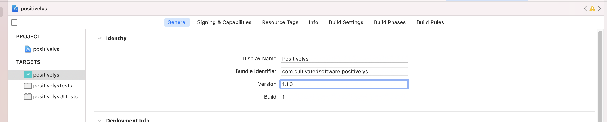
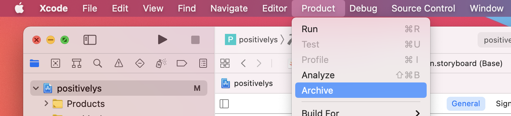
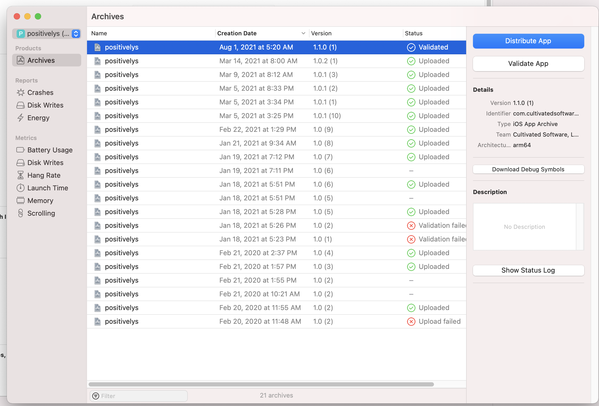

# Positivelys mono-repo

## Running Locally

The AppContext has an  `environment` property which can be defined as "development" or an empty string. When set to
"development" then the views are retrieved from a local server rather than the file system. This is done so
changes can be made to the views without having to recompile or restart the emulators. A local server must be running
to serve up the views. Inside `rust-code` start a development server `basic-http-server -a 0.0.0.0:3000`.

## Deploying to Test Flight/ App Store

1. Update the version number. Note, you'll bump the build number each subsequent time it's uploaded to the App Store. An
example would be if you found a bug while testing and need to update app with fix for it.
   
   
2. Archive the app to get it ready for distribution
   

4. Validate the app
   
   

5. Distribute the app -> App Store Connect -> Upload -> Both checked -> Automatic Manage Signing
